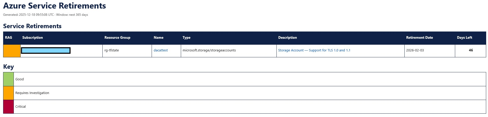

******************************************************************************* 
 
<b>PROJECT NAME:&emsp;&emsp;&emsp;&emsp;&nbsp;Azure Service Retirements 
CREATED BY:&emsp;&emsp;&emsp;&emsp;&emsp;&emsp;THEANGRYTECH-GIT 
REPO:&emsp;&emsp;&emsp;&emsp;&emsp;&emsp;&emsp;&emsp;&emsp;[([Azure Service Retirements](https://github.com/theangrytech-git/azure-service-retirements))]  
DESCRIPTION:</b>&emsp;&emsp;&emsp;&emsp;&emsp;&nbsp;This PowerShell script queries Azure Service Health to identify 
Service Retirement and end-of-life notifications affecting an Azure subscription. 
It extracts impact, region, and timeline details and generates a clear HTML report to  
help teams proactively plan and avoid disruption from retiring Azure services. 
 
It will highlight any Services due to retire within: 
365 days - treated as Informational 
90 days until retirement - treated as Medium Priority 
30 days until retirement - treated as High Priority 
 
The report will highlight what Feature/Service is due for Retirement (ie Support for TLS 1.0/1.1) 
and will provide a list of what the affected Resource Names are, what Resource Group they are in, 
what Subscription they are in, as well as how many days are left until the Feature/Service is retired. 

The report can either be run locally on your desktop, or as an Azure Runbook. 
 
<b>Serivce_Retirement_Locally_Run </b> - Allows you to run it locally from your Desktop using Powershell, 
to generate a report which will be emailed to you. Can be run at any point. 
You will need to change Lines 19-33 to match your Sendgrid API, Email Addresses, and Subcription details 
You can also change the 'Look Ahead' days on Lines 28-30 if you want longer/shorter reporting periods. 
 
<b>Serivce_Retirement_Azure_Runbook </b> - Can be added as an Azure Runbook, to run on a schedule within a 
Azure Automation Account. 
You will need to create the Automation Variables from Lines 19-32 and provide your Sendgrid API, Email addresses, and Subcription details 
******************************************************************************* 
 
<b>NOTES:</b> 
This will require the following to run:  
<b>Service Principal</b> - needs Reader Permissions on the Subscription 
<b>SendGrid API Key</b> - Used to send the email to the recipent. You can use an Azure-based 
solution like Azure Communication Services, or an Azure Function with SMTP. But I have 
a Sendgrid API so that's what I've built this around. 

******************************************************************************* 
 
This will create a single report that will report on any Services/Features that may retire within 365 days (Or as soon as reported by MS/Azure) 
and provides a one-stop report of any Resources that will be impacted by the Retirements from Azure.  
It's recommended that this report is run once a month, so you have a monthly report for any Clients/Projects that require it, as well 
as your Operations Teams. 
******************************************************************************* 
<b>Screenshots</b> 
******************************************************************************* 
 
Here's some screenshots of the report, with some details omitted for security purposes: 
 

 
*Figure 1: List of Service Retirements, running in a test subscription* 